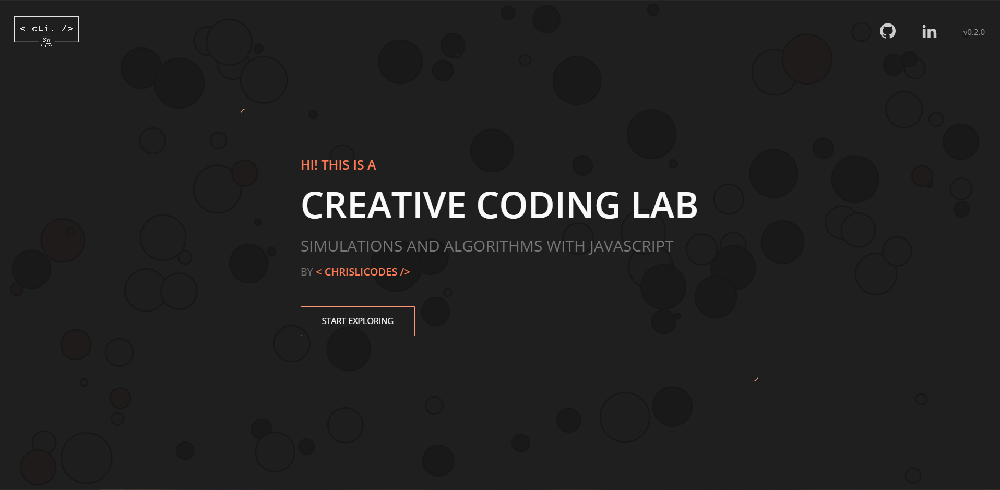

# Creative Coding Lab

Sandbox for exploring algorithms and simulations for immersive web experiences with HTML Canvas and WebGL.

## Labs

1. [Gravity Bubbles](https://chrislicodes.github.io/simulations-and-algorithms/labs/gravity-bubbles/)
   ([Dev Mode](https://chrislicodes.github.io/simulations-and-algorithms/gravity-bubbles/#dev))
2. [Boid Simulation](https://chrislicodes.github.io/simulations-and-algorithms/labs/boids/)
3. ... coming soon

## Roadmap

- complete folder and build restructure and refactor
